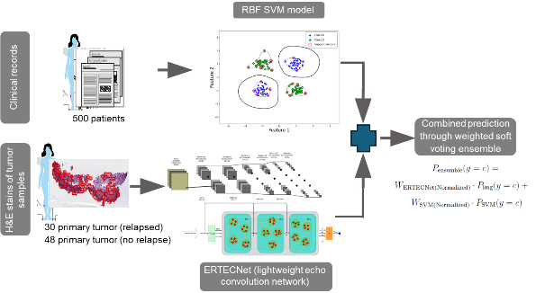

## Risk prediction of melanoma relapse using a multi-modal data classification algorithm that utilises routine clinical parameters and standard H&E histology of primary melanoma.

This multimodal pipeline was developed by Soner Berat Eren, Julia Richter, Sushmita Paul, Martin Eberhardt, Carola Berking, Michael Erdmann, and Julio Vera.

The proposed pipeline integrates two distinct machine learning architectures to evaluate patient risk using different data modalities. For the histopathological image modality, it utilizes the Enhanced Rapid Training Echo Convolution Network (ERTECNet)—a lightweight model with fewer than 600 thousand parameters that processes H&E stained images. ERTECNet combines a CNN feature extractor (inspired by MobileNetV3 and EfficientNet) with a Deep Echo State Network (DESN) by routing spatial features into a deep reservoir of sparsely connected neurons. For the clinical data modality, a non-linear Radial Basis Function Support Vector Machine (RBF SVM) evaluates routine clinical variables. Finally, the predictions from both the SVM and ERTECNet are combined using a weighted soft-voting procedure to yield a final metastatic risk probability score.



This folder contains the final workflow for preprocessing histology tiles, training models, generating probability outputs, and combining results with soft voting.

Most folders contain standalone scripts. In general, you can run them with:

```bash
python3 "path/to/script.py" [arguments]
```


## Folder Overview

1. `1.ROI_Extraction`  
   QuPath/Groovy-based ROI extraction.

2. `2.White_filtering`  
   Remove or move mostly white tiles.

3. `3.Moving_tile_randomly`  
   Randomly move `.tif` tiles between folders.

4. `4.Compute_channel_normalization`  
   Compute per-channel mean and standard deviation for datasets.

5. `5.Train_ERTECNet`  
   Train the ERTECNet model.

6. `6.Use_trained ERTECnet_to_obtain_probability_score`  
   Run inference with a trained ERTECNet checkpoint and export probabilities.

7. `7.SVM_Train`  
   Train the SVM model on clinical data.

8. `8.Use_trained_model _for_probalistic_output`  
   Run inference on clinical data with the trained SVM model.

9. `9.Soft_voting`  
   Combine ERTECNet and SVM probabilities into a final prediction.

## How To Run Python Scripts

### Example 1: Compute normalization values

```bash
cd /home/erensr/final
python3 "4.Compute_channel_normalization/compute_uniklinikum_norm.py" \
  --data-dir /home/erensr/data/random_uniklinikum/train \
  --batch-size 256
```

### Example 2: Train the SVM model

```bash
cd /home/erensr/final
python3 "7.SVM_Train/train_random_uni_svm.py" \
  --csv-path "/home/erensr/final/7.SVM_Train/random_uni.csv" \
  --model-out "/home/erensr/final/8.Use_trained_model _for_probalistic_output/random_uni_svm.joblib"
```

### Example 3: Run inference with the SVM model trained in step 7

```bash
cd /home/erensr/final
python3 "8.Use_trained_model _for_probalistic_output/predict_random_uni.py" \
  --csv-path /path/to/new_samples.csv \
  --model-path "/home/erensr/final/8.Use_trained_model _for_probalistic_output/random_uni_svm.joblib" \
  --out-csv "/home/erensr/final/9.Soft_voting/output_svm.csv"
```

### Example 4: Train ERTECNet

```bash
cd /home/erensr/final
python3 "5.Train_ERTECNet/ERTECNet_final_edition.py" \
  --dataset random_uniklinikum \
  --dataset-root /home/erensr/data/random_uniklinikum \
  --image-size 96 96 \
  --batch-size 1024 \
  --epochs 100 \
  --save-best-path "/home/erensr/final/5.Train_ERTECNet/unioutput/model_uni.pt" \
  --metrics-path "/home/erensr/final/5.Train_ERTECNet/unioutput/uni_output.csv" \
  --save-cm \
  --cm-dir "/home/erensr/final/5.Train_ERTECNet/unioutput/cm" \
  --save-roc \
  --roc-dir "/home/erensr/final/5.Train_ERTECNet/unioutput/roc"
```

Expected dataset structure for this example:

### Example 5: Predict image probabilities with ERTECNet

```bash
cd /home/erensr/final
PYTHONPATH="/home/erensr/final/5.Train_ERTECNet" \
python3 "6.Use_trained ERTECnet_to_obtain_probability_score/image_predict_random_uniklinikum.py" \
  --checkpoint "/home/erensr/final/5.Train_ERTECNet/unioutput/model_uni.pt" \
  --image /path/to/image_or_folder \
  --csv-out "/home/erensr/final/9.Soft_voting/tile_new/new_case.csv"
```

### Example 6: Run soft voting

```bash
cd /home/erensr/final
python3 "9.Soft_voting/soft_voting.py" "MM 00006" \
  --svm-results-file "/home/erensr/final/9.Soft_voting/output_svm.csv" \
  --ertecnet-results-file "/home/erensr/final/9.Soft_voting/tile_new/21034834.csv" \
  --output-file "/home/erensr/final/9.Soft_voting/final_soft_voting.csv"
```

## Notes

- Some scripts are not fully parameterized. For example, `2.White_filtering/code.py` currently uses hard-coded paths inside the file, so you should edit the paths there before running it.
- The ERTECNet inference script in folder `6` imports `ERTECNet_final_edition.py` from the training folder, which is why the example sets `PYTHONPATH`(or simply move the `ERTECNet_final_edition.py` " :D).
- Step `1.ROI_Extraction` is a Groovy/QuPath step rather than a Python step.

## Quick Tip

To see which arguments a script supports:

```bash
python3 "path/to/script.py" --help
```

## License

This project is licensed under the [PolyForm Noncommercial 1.0.0 License](LICENSE). Non-commercial use only.
